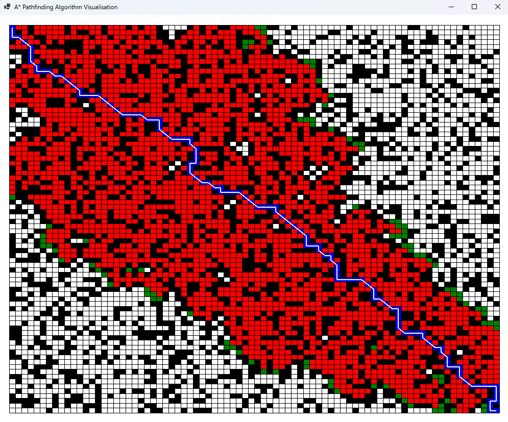
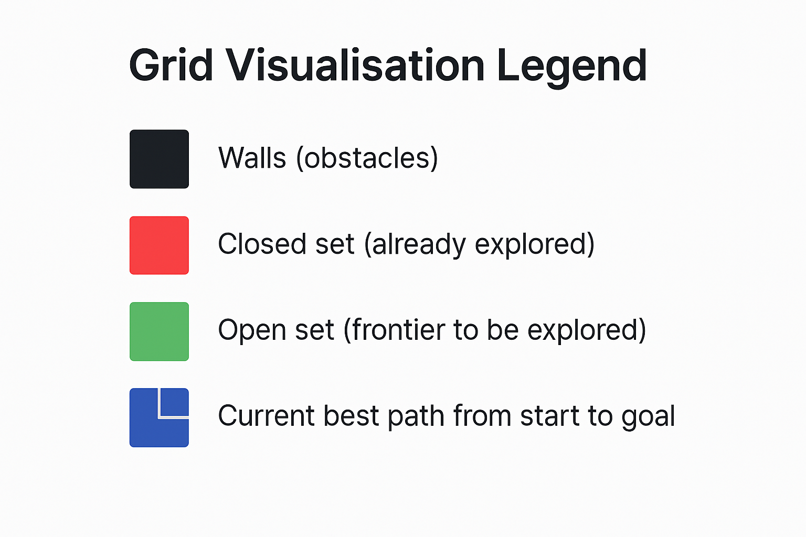
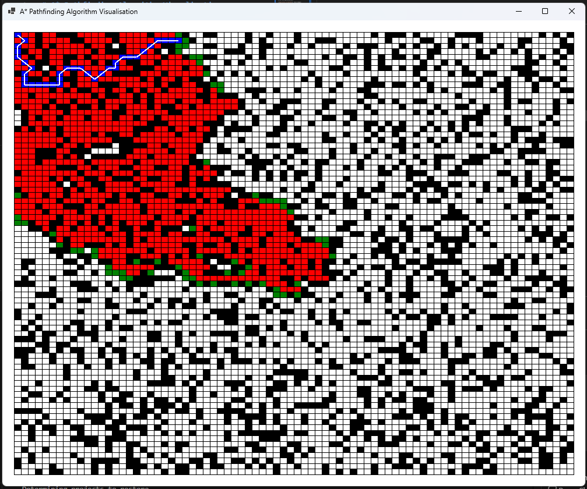
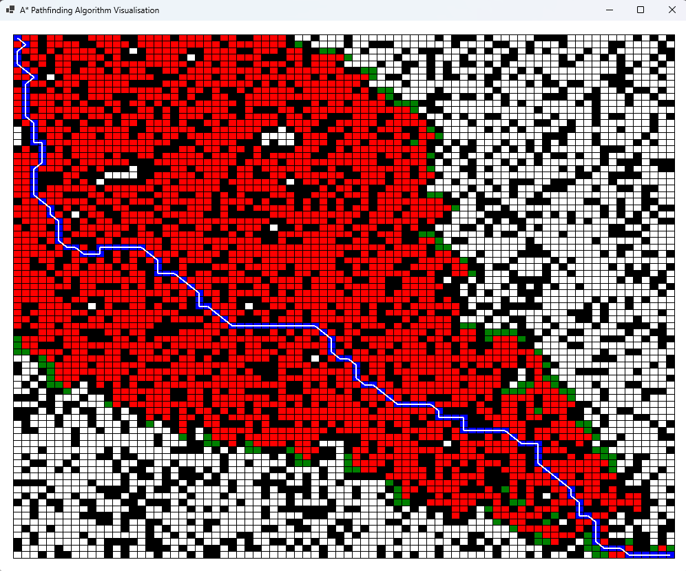
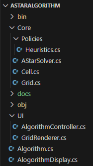
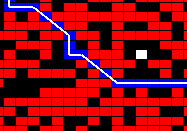

# A* Pathfinding Algorithm Visualisation

A Windows Forms (WinForms) application that visualises the A* pathfinding algorithm in real-time, demonstrating intelligent grid-based navigation with diagonal movement and corner-cutting prevention.


*Live visualisation of A* pathfinding in action

---

## Table of Contents

- [Purpose](#purpose)
- [What Is A*?](#what-is-a)
- [Features](#features)
- [Visualisation](#visualisation)
- [Project Structure](#project-structure)
- [Getting Started](#getting-started)
- [Implementation Details](#implementation-details)
- [Heuristics](#heuristics)

---

## Purpose

This project was created to:

- **Refresh understanding** of pathfinding algorithms, particularly Dijkstra's algorithm.
- **Demonstrate A* in action** with a real-time visual representation.
- **Explore game development techniques** — pathfinding is fundamental to AI navigation in games, from NPCs finding routes to strategic unit movement.
- **Apply software engineering principles** — the codebase is split into Core (algorithm logic) and UI (rendering and control) to follow the SOLID principles.

---

## What Is A*?

**A*** (A-star) is a best-first search algorithm that finds the shortest path between two points on a graph or grid. It's an enhancement of **Dijkstra's algorithm**, which guarantees the shortest path but explores uniformly in all directions.

### Dijkstra vs A*

- **Dijkstra's Algorithm**: Explores nodes in order of increasing distance from the start. Guarantees the shortest path but can be slow because it searches everywhere.
- **A* Algorithm**: Uses a **heuristic** to estimate the remaining cost to the goal. This guides the search toward the target, making it much faster whilst still guaranteeing an optimal path (when using an admissible heuristic).

**Formula**:  
For each cell, A* calculates:

```
f(n) = g(n) + h(n)
```

- **g(n)**: Cost from the start to the current cell.
- **h(n)**: Estimated cost from the current cell to the goal (heuristic).
- **f(n)**: Total estimated cost of the path through this cell.

The algorithm always expands the node with the lowest `f` value.

---

## Features

- ✅ **Real-time visualisation** of the A* search process.
- ✅ **8-directional movement** (orthogonal + diagonal).
- ✅ **Corner-cutting prevention** — diagonals are blocked if adjacent orthogonal cells are walls.
- ✅ **Chebyshev heuristic** — optimal for 8-direction grids.
- ✅ **Randomised wall generation** for varied scenarios.
- ✅ **Clear visual feedback**:
  - **Black cells**: Walls (obstacles)
  - **Red cells**: Closed set (already explored)
  - **Green cells**: Open set (frontier to be explored)
  - **Blue cells with white lines**: Current best path from start to goal


*Colour legend for the grid visualisation*

---

## Visualisation

The application renders an 80×80 grid with approximately 30% random wall density. The search progresses automatically, with configurable step speed.

### What You'll See

1. **Initial State**: Grid with random walls; start at top-left `(0,0)`, goal at bottom-right.
2. **Search Progress**: 
   - Green cells spread outward from the start.
   - Red cells mark explored territory.
   - Blue path updates dynamically as better routes are found.
3. **Completion**: When the goal is reached, the final optimal path is displayed in blue.


*A* exploring the grid — green shows the frontier, red shows visited cells*


*Final optimal path highlighted in blue*

---

## Project Structure

The solution is organised into **Core** (algorithm logic) and **UI** (presentation):

```
AStarAlgorithm/
├── Core/
│   ├── Cell.cs                 # Grid cell with A* scores (f, g, h, parent)
│   ├── Grid.cs                 # 2D grid with neighbour generation
│   ├── AStarSolver.cs          # A* algorithm implementation
│   └── Policies/
│       └── Heuristics.cs       # IHeuristic interface + ChebyshevHeuristic
├── UI/
│   ├── GridRenderer.cs         # Renders grid, open/closed sets, and path
│   └── AlgorithmController.cs  # Timer-driven solver stepping
├── Algorithm.cs                # Wires Core + UI components (AlgorithmLogic)
├── AlogorithmDisplay.cs        # Main WinForms window
├── Program.cs                  # Application entry point
└── README.md                   # This file
```

### Separation of Concerns

- **Core**: Contains pure algorithm logic with no UI dependencies.
- **UI**: Handles rendering (via `Graphics`) and timer-based updates.
- **Algorithm.cs**: Acts as the coordinator, initialising the grid, solver, renderer, and controller.


*High-level overview showing Core/UI separation*

---

## Getting Started

### Prerequisites

- **.NET 8.0 or .NET 9.0** (Windows)
- **Windows OS** (WinForms requirement)
- **Visual Studio 2022** or **VS Code** with C# extension

### Build & Run

1. **Clone the repository**:
   ```bash
   git clone https://github.com/haywardm/AStarAlgorithm.git
   cd AStarAlgorithm
   ```

2. **Restore dependencies**:
   ```powershell
   dotnet restore
   ```

3. **Build the project**:
   ```powershell
   dotnet build -c Debug
   ```

4. **Run the application**:
   ```powershell
   dotnet run -c Debug
   ```

   Alternatively, open `AStarAlgorithm.sln` in Visual Studio and press `F5`.

### Configuration

You can adjust parameters in `Algorithm.cs`:

- **Grid size**: `columns` and `rows` (default: 80×80)
- **Window size**: `width` and `height` (default: 1000×800)
- **Search speed**: `intervalMs` and `stepsPerTick` in `AlgorithmController` constructor (default: 100ms interval, 5 steps per tick)
- **Wall density**: Modify `rng.NextDouble() < 0.3` in `Cell.cs` (default: 30%)

---

## Implementation Details

### Corner-Cutting Prevention

Diagonal movement is only allowed when **both adjacent orthogonal cells are free**. For example, moving diagonally from `(x, y)` to `(x+1, y+1)` requires that both `(x+1, y)` and `(x, y+1)` are not walls.

This is implemented in `Grid.addNeighbours()`:

```csharp
// Diagonal: top-right
if (x < Columns - 1 && y > 0 && isFree(x + 1, y) && isFree(x, y - 1))
{
    current.neighbours.Add(cells[x + 1, y - 1]);
}
```


*Diagonal moves blocked when adjacent cells are walls*

### Per-Cell State

Each `Cell` stores:

- **Position**: `x`, `y`
- **A* Scores**: `f`, `g`, `h`
- **Parent**: Reference to the previous cell in the current best path
- **Neighbours**: Precomputed list of reachable adjacent cells
- **Wall flag**: `isWall` (randomly assigned at construction)

### Algorithm Flow

1. **Initialisation** (`AStarSolver.Initialize`):
   - Clear open/closed sets and reset all cell scores.
   - Add start cell to open set with `g=0`, `h=heuristic(start, goal)`.

2. **Stepping** (`AStarSolver.Step`):
   - Select cell with lowest `f` from open set.
   - If it's the goal, reconstruct path and finish.
   - Move current cell from open to closed set.
   - For each neighbour:
     - Skip if in closed set or is a wall.
     - Calculate tentative `g` (current `g` + 1).
     - If neighbour is new or this path is better, update `g`, `h`, `f`, and parent.

3. **Path Reconstruction** (`ReconstructPath`):
   - Follow parent links from current cell back to start.
   - Updates `currentPath` list for visualisation.

---

## Heuristics

### Chebyshev Distance

This project uses the **Chebyshev heuristic**, which is optimal for grids allowing 8-directional movement:

```csharp
h(a, b) = max(|a.x - b.x|, |a.y - b.y|)
```

This heuristic is **admissible** (never overestimates) and **consistent**, ensuring A* finds the optimal path.

### Alternative Heuristics

The `IHeuristic` interface allows easy swapping:

- **Manhattan Distance**: `|a.x - b.x| + |a.y - b.y|` (4-direction grids)
- **Euclidean Distance**: `sqrt((a.x - b.x)² + (a.y - b.y)²)` (continuous space)

To use a different heuristic, implement `IHeuristic` and change the field in `AStarSolver.cs`:

```csharp
private readonly IHeuristic heuristic = new ManhattanHeuristic();
```
---

## Acknowledgements

Built as a learning exercise to explore pathfinding algorithms and their application in game development. In particular:

- Followed the tutorial by [The Coding Train](https://www.youtube.com/@TheCodingTrain) on YouTube for grasping the basics and getting started with the A* Pathfinding Algorithm.
- Followed the pseudocode from Wikipedia’s [A* search algorithm](https://en.wikipedia.org/wiki/A*_search_algorithm).

---

## Licence

This project is licensed under the MIT Licence. Feel free to use, modify, and distribute as you see fit.


---
